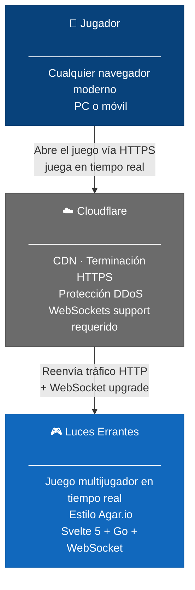
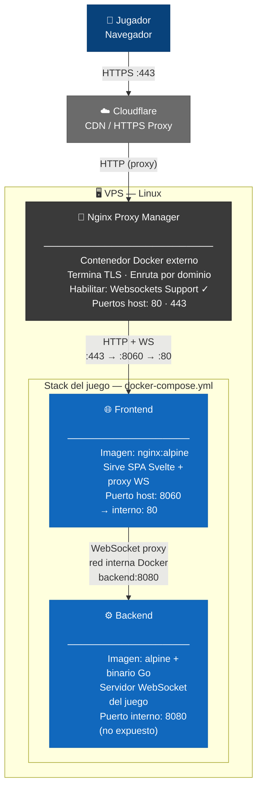
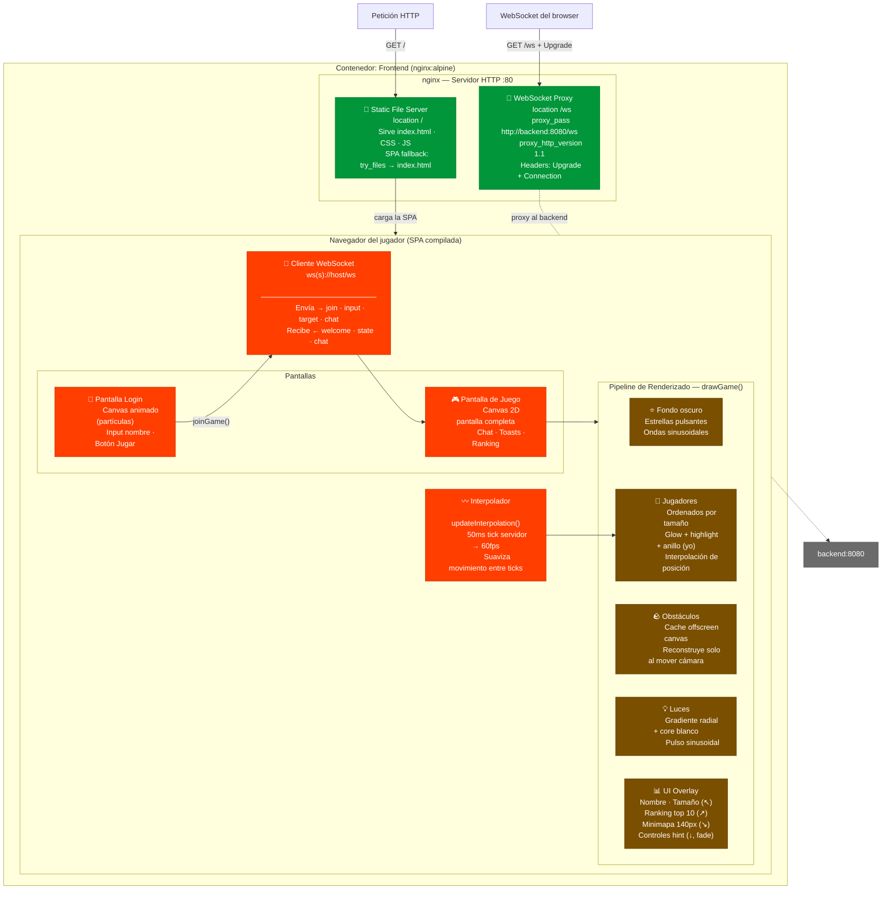
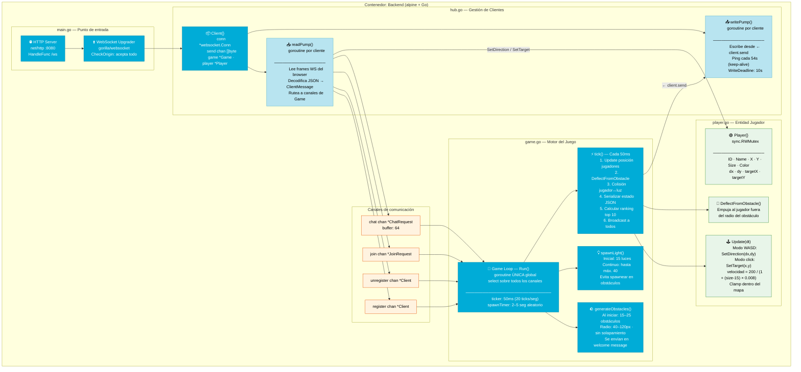
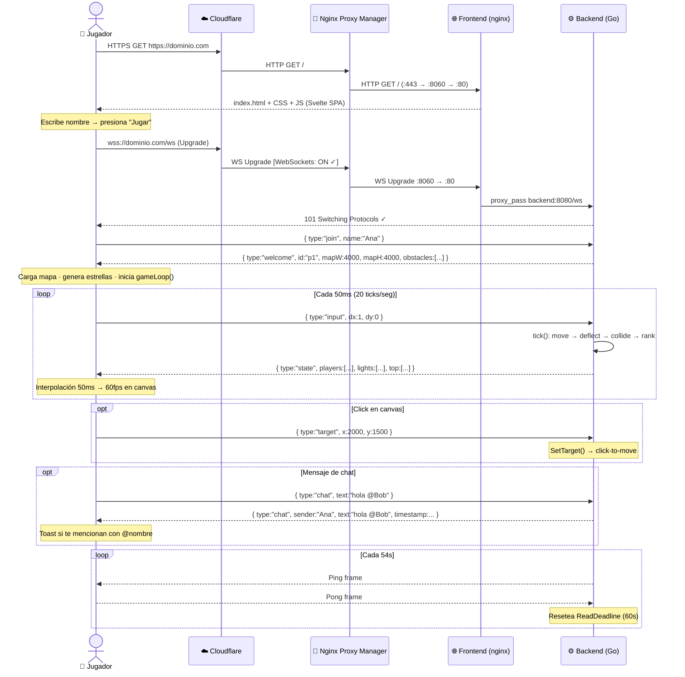
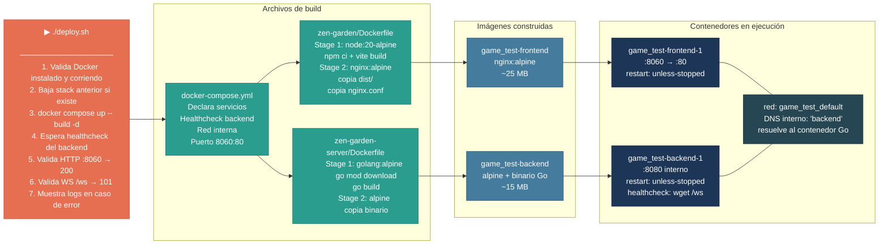

# C4 — Arquitectura de Luces Errantes

El modelo **C4** describe la arquitectura en cuatro niveles de zoom progresivo. Cada nivel revela más detalle sin perder el contexto global.

| Nivel | Pregunta que responde |
|---|---|
| **L1 — Contexto** | ¿Quién usa el sistema y con qué servicios externos interactúa? |
| **L2 — Contenedores** | ¿Qué procesos o artefactos desplegables componen el sistema? |
| **L3 — Componentes** | ¿Qué piezas internas tiene cada contenedor? |
| **L4 — Código** | ¿Cómo se implementa cada componente? → ver código fuente |

---

## L1 — Contexto del Sistema

El sistema es un juego multijugador en tiempo real. Los jugadores acceden desde el navegador a través de Cloudflare, que gestiona el HTTPS y protege contra DDoS.



| Elemento | Tipo | Descripción |
|---|---|---|
| Jugador | Actor humano | Accede desde el navegador, interactúa solo con teclado y mouse |
| Cloudflare | Sistema externo | Gestiona HTTPS, CDN y protección DDoS. Requiere **WebSockets activado** en el dashboard |
| Luces Errantes | Sistema principal | Frontend + backend desplegados como contenedores Docker en un VPS |

---

## L2 — Contenedores

Cuatro contenedores cooperan para entregar el juego. El tráfico entra por Nginx Proxy Manager, que enruta hacia el frontend (nginx sirviendo la SPA), que a su vez hace proxy del WebSocket hacia el backend Go.



| Contenedor | Imagen base | Puerto | Responsabilidad |
|---|---|---|---|
| Nginx Proxy Manager | jc21/nginx-proxy-manager | 80 / 443 (host) | TLS, routing por dominio, WebSocket forwarding |
| Frontend | nginx:alpine | 8060→80 | Sirve el build de Svelte + proxy inverso de `/ws` al backend |
| Backend | alpine | 8080 (interno) | Motor del juego, conexiones WebSocket, broadcast de estado |

> **Red Docker interna**: frontend y backend comparten la red `game_test_default` creada por docker-compose. El frontend resuelve `backend` como hostname directamente sin exponer el puerto 8080 al host.

---

## L3 — Componentes del Frontend

El contenedor frontend tiene dos capas: **nginx** que sirve archivos estáticos y hace proxy del WebSocket, y la **SPA Svelte** que corre en el navegador del jugador.



| Componente | Archivo fuente | Función |
|---|---|---|
| Static File Server | `nginx.conf location /` | Sirve `dist/` con fallback `index.html` para rutas SPA |
| WebSocket Proxy | `nginx.conf location /ws` | Proxy al backend con headers `Upgrade` + `Connection: upgrade` |
| Pantalla Login | `App.svelte` | Canvas animado de fondo, formulario de nombre, inicia WS |
| Cliente WebSocket | `App.svelte joinGame()` | Abre `ws(s)://host/ws`, envía `join`, despacha mensajes recibidos |
| Pantalla de Juego | `App.svelte` | Canvas a pantalla completa + chat lateral + toasts de mención |
| Caché de Obstáculos | `App.svelte buildObstacleCache()` | Dibuja obstáculos en un canvas offscreen y lo reutiliza hasta que la cámara se aleja 100px |
| Interpolador | `App.svelte updateInterpolation()` | Interpola posiciones entre el tick anterior y el nuevo para 60fps fluidos |
| UI Overlay | `App.svelte drawGame()` | Dibuja info, ranking, minimapa y hint de controles sin transformación de cámara |

---

## L3 — Componentes del Backend

El contenedor backend es un único binario Go. Una **goroutine por cliente** gestiona I/O de WebSocket, y una **goroutine global única** ejecuta toda la lógica del juego — esto elimina la necesidad de locks para el estado compartido del juego.



| Componente | Archivo | Goroutines | Responsabilidad |
|---|---|---|---|
| HTTP Server | `main.go` | 1 (main) | Escucha en `:8080`, endpoint único `/ws` |
| WebSocket Upgrader | `main.go` | — | Convierte HTTP→WS, crea `Client{}`, arranca las 2 goroutines |
| Client | `hub.go` | 2 por cliente | Abstrae la conexión con canal de salida `send` |
| readPump | `hub.go` | 1 por cliente | Lee frames, decodifica JSON, envía a canales del Game; deadline 60s reset por pong |
| writePump | `hub.go` | 1 por cliente | Escribe desde `send`, envía ping cada 54s; deadline 10s por escritura |
| Game Loop | `game.go` | 1 global | Único modificador del estado del juego — sin data races en maps/players |
| generateObstacles | `game.go` | — | Genera 15–25 obstáculos al iniciar, sin solapamiento, radio 40–120px |
| spawnLight | `game.go` | — | Crea luces aleatorias fuera de obstáculos; inicial 15, máx. 40 |
| tick | `game.go` | — | Paso de simulación: move → deflect → collide → rank → broadcast |
| Player | `player.go` | — | Entidad con `sync.RWMutex` porque `readPump` la accede desde otra goroutine |

---

## Flujo WebSocket — De punta a punta



---

## Protocolo de Mensajes

### Cliente → Servidor

| Tipo | Campos | Cuándo |
|---|---|---|
| `join` | `name` (max 20 chars) | Una vez al conectar |
| `input` | `dx`, `dy` (−1, 0, 1) | Cada keydown / keyup |
| `target` | `x`, `y` (coord. mundo) | Cada click en el canvas |
| `chat` | `text` (max 200 chars) | Al enviar mensaje |

### Servidor → Cliente

| Tipo | Campos | Frecuencia |
|---|---|---|
| `welcome` | `id`, `mapW`, `mapH`, `obstacles[]` | 1 vez tras `join` |
| `state` | `players[]`, `lights[]`, `top[]` | 20 veces/seg |
| `chat` | `sender`, `text`, `timestamp` | Al recibir mensaje de cualquier jugador |

---

## Despliegue



| Archivo | Ubicación | Función |
|---|---|---|
| `deploy.sh` | raíz | Orquesta todo: checks → down → build → up → validate |
| `docker-compose.yml` | raíz | Declara los dos servicios, red interna y healthcheck |
| `Dockerfile` | `zen-garden/` | Build multi-stage: Svelte → nginx con SPA |
| `Dockerfile` | `zen-garden-server/` | Build multi-stage: compilación Go → binario mínimo |
| `nginx.conf` | `zen-garden/` | Sirve SPA + proxy WebSocket al backend |
| `.dockerignore` | `zen-garden/` | Excluye `node_modules/` y `dist/` del contexto de build |

---

## Resumen de la cadena completa

```
Jugador (browser)
    │
    │  wss://dominio.com/ws  (HTTPS/WSS puerto 443)
    ▼
Cloudflare
    │  WebSockets: ON requerido en Dashboard → Network
    │  HTTP (proxy inverso hacia el VPS)
    ▼
Nginx Proxy Manager  [contenedor Docker, VPS]
    │  Websockets Support: ON requerido en Proxy Host
    │  Enruta dominio → localhost:8060
    ▼
Frontend  [contenedor Docker, imagen nginx:alpine]
    │  Puerto 8060 (host) → 80 (contenedor)
    ├── GET /     → sirve build de Svelte (index.html + assets)
    └── GET /ws   → proxy_pass http://backend:8080/ws
                              │
                              │  WebSocket puro, red interna Docker
                              ▼
Backend  [contenedor Docker, binario Go en alpine]
    │  Puerto 8080 (solo red interna, no expuesto al host)
    │
    ├── 1 goroutine main         → HTTP server, acepta conexiones
    ├── 2 goroutines por cliente → readPump + writePump
    └── 1 goroutine global       → Game Loop (20 ticks/seg)
                                      ├── Mueve jugadores
                                      ├── Deflecta de obstáculos
                                      ├── Colisiones jugador ↔ luz
                                      ├── Ranking top 10
                                      └── Broadcast estado JSON
```
